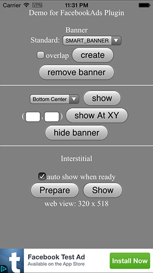
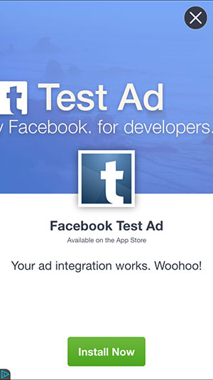
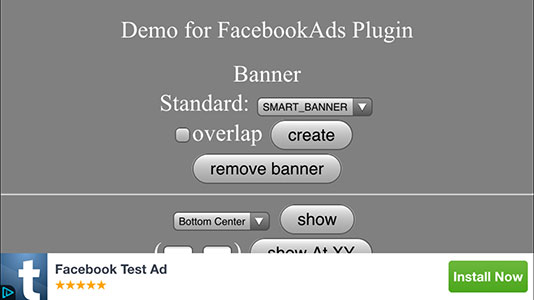
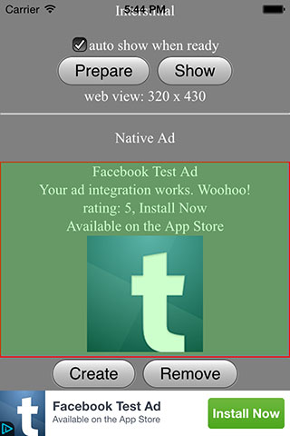

# Cordova Plugin for Facebook Audience Network #

Present Facebook Ads in Mobile App/Games natively from JavaScript. 

Highlights:
- [x] Easy-to-use APIs. Display Ad with single line of Js code.
- [x] Support Banner, Interstitial Ad, and Native Ad.
- [x] One plugin supports both Android and iOS platform.
- [x] Fixed and overlapped mode.
- [x] Auto fit on orientation change.
- [x] Actively maintained, prompt support.

Compatible with:

* Cordova CLI, v3.5+
* Intel XDK and Crosswalk, r1095+
* IBM Worklight, v6.2+

## How to use? ##

If use with Cordova CLI:
```
cordova plugin add com.rjfun.cordova.facebookads
```

If use with Intel XDK:
Project -> CORDOVA 3.X HYBRID MOBILE APP SETTINGS -> PLUGINS AND PERMISSIONS -> Third-Party Plugins ->
Add a Third-Party Plugin -> Get Plugin from the Web, input:
```
Name: FacebookAdsPluginPro
Plugin ID: com.rjfun.cordova.facebookads
[x] Plugin is located in the Apache Cordova Plugins Registry
```

## Quick Start Example Code ##

Step 1: Prepare your Facebook Audience Network Placement Id for your app, create it in [Facebook Developers website](https://developers.facebook.com/)

```javascript
var ad_units = {
	ios : { 
		banner:"your_ad_place_id",
		interstitial:"your_ad_place_id"
	},
	android : {
		banner:"your_ad_place_id",
		interstitial:"your_ad_place_id"
	}
};

// select the right Ad Id according to platform
var adid = (/(android)/i.test(navigator.userAgent)) ? ad_units.android : ad_units.ios;

// set your hashed device id if testing on device (optional)
if(FacebookAds) FacebookAds.setOptions({
	isTesting: true,
	deviceHash: 'copy_your_hash_id_from_console_here'
});
```

Step 2: Create a banner with single line of javascript

```javascript
// it will display smart banner at top center, using the default options
if(FacebookAds) FacebookAds.createBanner( adid.banner );
```

Or, show the banner Ad in some other way:

```javascript
// or, show a default banner at bottom
if(FacebookAds) FacebookAds.createBanner( {
	adId: adid.banner, 
	position:FacebookAds.AD_POSITION.BOTTOM_CENTER, 
	autoShow:true} );
```

Step 3: Prepare an interstitial, and show it when needed

```javascript
// preppare and load ad resource in background, e.g. at begining of game level
if(FacebookAds) FacebookAds.prepareInterstitial( {adId:adid.interstitial, autoShow:false} );

// show the interstitial later, e.g. at end of game level
if(FacebookAds) FacebookAds.showInterstitial();
```

You can even embed the Ad into web content with Native Ad.

Check the example code [test/index.html] (https://github.com/floatinghotpot/cordova-plugin-facebookads/blob/master/test/index.html)

## Javascript API Overview ##

Methods:
```javascript
// set default value for other methods
setOptions(options, success, fail);
// for banner
createBanner(adId/options, success, fail);
removeBanner();
showBanner(position);
showBannerAtXY(x, y);
hideBanner();
// for interstitial
prepareInterstitial(adId/options, success, fail);
showInterstitial();
// for native ad
createNativeAd(adId, success, fail);
removeNativeAd(adId);
setNativeAdClickArea(adId,x,y,w,h);
```

## Detailed Documentation ##

The APIs, Events and Options are detailed documented.

Read the detailed API Reference Documentation [English](https://github.com/floatinghotpot/cordova-plugin-facebookads/wiki).

## FAQ ##

If encounter problem when using the plugin, please read the [FAQ](https://github.com/floatinghotpot/cordova-plugin-facebookads/wiki/FAQ) first.

## Full Example Code ##

This FacebookAds Plugin Pro offers the most flexibility and many options.

Check the [test/index.html] (https://github.com/floatinghotpot/cordova-plugin-facebookads/blob/master/test/index.html).

## Screenshots ##

iPhone Banner | iPhone Interstitial
-------|---------------
 | 

iPhone Landscape



iPhone Native Ad | Android Native Ad
-------|---------------
 | 

Ad PluginPro series for the world leading Mobile Ad services:

* [GoogleAds PluginPro](https://github.com/floatinghotpot/cordova-admob-pro), for Google AdMob/DoubleClick.
* [iAd PluginPro](https://github.com/floatinghotpot/cordova-iad-pro), for Apple iAd. 
* [FacebookAds PluginPro](https://github.com/floatinghotpot/cordova-plugin-facebookads), for Facebook Audience Network.
* [FlurryAds PluginPro](https://github.com/floatinghotpot/cordova-plugin-flurry), for Flurry Ads.
* [mMedia PluginPro](https://github.com/floatinghotpot/cordova-plugin-mmedia), for Millennial Meida.
* [MobFox PluginPro](https://github.com/floatinghotpot/cordova-mobfox-pro), for MobFox.
* [MoPub PluginPro](https://github.com/floatinghotpot/cordova-plugin-mopub), for MoPub.

More Cordova/PhoneGap plugins by Raymond Xie, [find them in plugin registry](http://plugins.cordova.io/#/search?search=rjfun).

If use in commercial project or need prompt support, please [buy a license](http://rjfun.github.io/), you will be served with high priority.

Project outsourcing and consulting service is also available. Please [contact us](mailto:rjfun.mobile@gmail.com) if you have the business needs.

